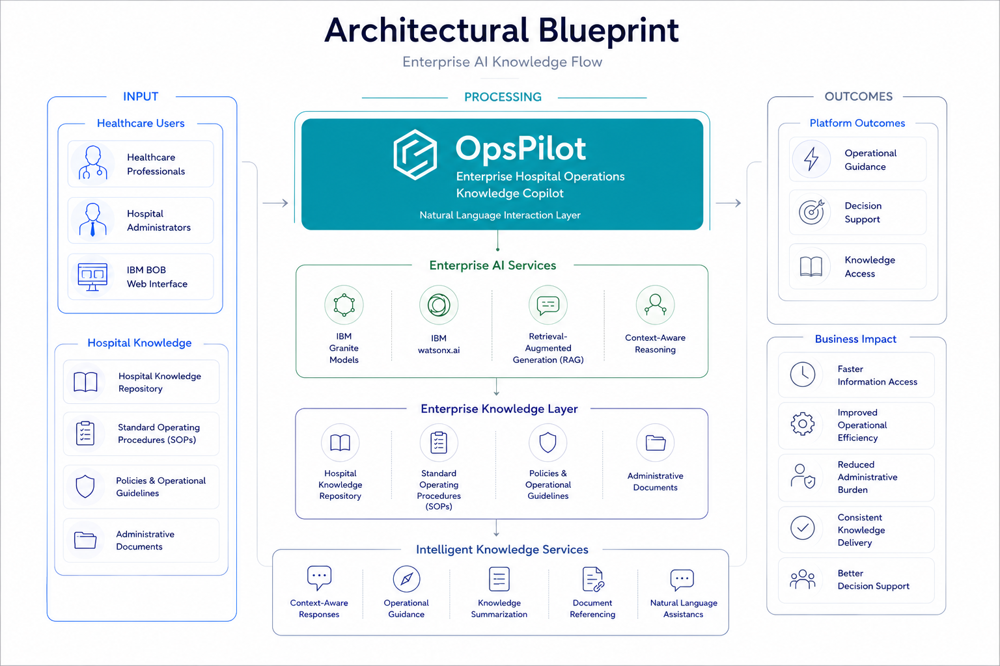
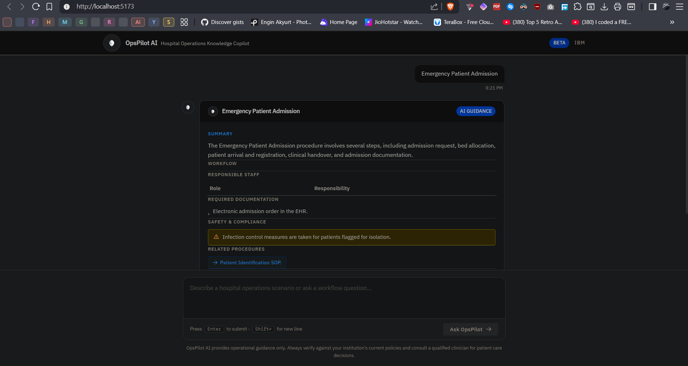
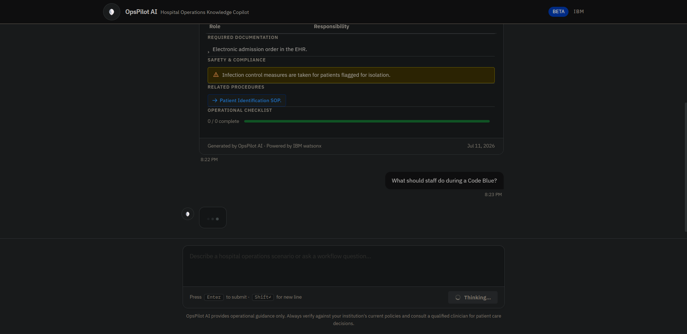
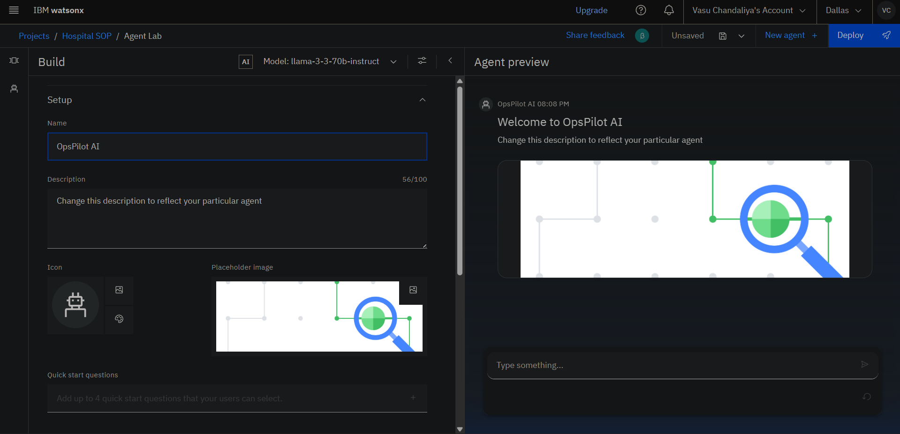

<p align="center">

</p>

<div align="center">

# OpsPilot AI

### Enterprise Hospital Operations Knowledge Copilot

*Empowering healthcare professionals with operational guidance through Retrieval-Augmented Generation (RAG) and IBM watsonx.ai.*

<p>
  
</p>


</div>

<p align="center">

🏥 Enterprise Healthcare AI

⚡ FastAPI Backend

🧠 IBM watsonx.ai

🔒 Secure IAM Authentication

📚 Retrieval-Augmented Generation

🎯 React + Tailwind Interface

</p>

---
### Contents

- [Why OpsPilot AI?](#why-opspilot-ai)
- [Vision](#vision)
- [The Challenge](#the-challenge)
- [Current Capabilities](#current-capabilities)
- [System Architecture](#system-architecture)
- [Technology Stack](#technology-stack)
- [Key Features](#key-features)
- [Project Structure](#project-structure)
- [Product Walkthrough](#product-walkthrough)
- [IBM watsonx.ai Integration](#ibm-watsonxai-integration)
- [Security Architecture](#security-architecture)
- [Current Limitations](#current-limitations)
- [Disclaimer](#disclaimer)
- [Engineering Principles](#engineering-principles)
- [Design Philosophy](#design-philosophy)
- [Getting Started](#getting-started)
- [Environment Variables](#environment-variables)
- [Repository Status](#repository-status)
- [Roadmap](#roadmap)
- [Acknowledgements](#acknowledgements)

> **OpsPilot AI** is an enterprise healthcare operations knowledge copilot designed to help hospital staff quickly retrieve trusted operational guidance using IBM watsonx.ai and Retrieval-Augmented Generation (RAG). Rather than replacing institutional policies, it provides contextual assistance to improve operational efficiency, consistency, and decision support.


# Why OpsPilot AI?

Hospitals generate enormous amounts of operational knowledge every day.

The challenge is not the absence of information, but the ability to retrieve trusted guidance quickly when it matters most.

OpsPilot AI transforms institutional knowledge into an intelligent operational copilot, helping healthcare professionals navigate workflows through contextual, AI-assisted guidance powered by IBM watsonx.ai.

# Vision

OpsPilot AI aims to become an enterprise knowledge copilot for hospital operations, enabling healthcare professionals to retrieve trusted institutional guidance through natural language interactions.

The long-term vision extends beyond question answering to intelligent operational assistance, workflow navigation, compliance support, and enterprise knowledge management while keeping humans in control of operational decision-making.

# The Challenge

Modern hospitals rely on hundreds of operational procedures, standard operating procedures (SOPs), escalation pathways, emergency workflows, and compliance documents. Accessing the right information during time-sensitive situations can be difficult, leading to delays, inconsistent decision-making, and increased operational burden.

Healthcare professionals need a reliable way to retrieve operational guidance quickly without manually searching through extensive documentation.

OpsPilot AI addresses this challenge by combining enterprise search, Retrieval-Augmented Generation (RAG), and IBM watsonx.ai to deliver structured, context-aware operational guidance while keeping institutional knowledge at the center of every response.

# Current Capabilities

OpsPilot AI provides an intelligent interface that enables healthcare professionals to query operational scenarios using natural language.

The platform retrieves relevant organizational knowledge, augments the user query with contextual information, and generates structured guidance using IBM watsonx.ai.

Current capabilities include:

- Structured operational guidance
- Context-aware workflow assistance
- Responsible staff identification
- Operational checklists
- Documentation guidance
- Safety and compliance reminders
- Enterprise-ready backend architecture

# System Architecture

OpsPilot AI follows a modular enterprise architecture designed to separate user interaction, application logic, AI inference, and security responsibilities.

The frontend provides a responsive React-based interface where healthcare professionals can describe operational scenarios using natural language.

Instead of communicating directly with IBM watsonx.ai, all requests are routed through a secure FastAPI backend. This architecture prevents exposure of API credentials while allowing centralized authentication, request validation, future audit logging, caching, and enterprise integrations.

The backend authenticates using IBM Cloud IAM, retrieves a temporary access token, forwards the request to the deployed IBM watsonx.ai service, and returns the generated guidance to the frontend.

This layered approach enables secure deployment while keeping the frontend completely independent of authentication and AI provider implementation details.

<p align="center">
  
</p>

# Technology Stack

OpsPilot AI is built using a modern, modular technology stack designed for enterprise AI applications.

## Core Technologies

| Category | Technology |
|-----------|------------|
| Frontend | React + Vite |
| UI Framework | Tailwind CSS |
| Backend | FastAPI |
| AI Platform | IBM watsonx.ai |
| Authentication | IBM Cloud IAM |
| API | REST |
| Programming Languages | Python, JavaScript |
| Deployment | IBM watsonx Deployment Space |
| Knowledge Layer | Retrieval-Augmented Generation (RAG) |

---

## Application Architecture

```text
┌─────────────────────────────┐
│     React + Vite Frontend   │
└──────────────┬──────────────┘
               │
               ▼
┌─────────────────────────────┐
│       Tailwind CSS UI       │
└──────────────┬──────────────┘
               │
               ▼
┌─────────────────────────────┐
│      FastAPI Backend        │
└──────────────┬──────────────┘
               │
               ▼
┌─────────────────────────────┐
│      IBM Cloud IAM          │
└──────────────┬──────────────┘
               │
               ▼
┌─────────────────────────────┐
│    IBM watsonx.ai Model     │
└──────────────┬──────────────┘
               │
               ▼
┌─────────────────────────────┐
│ Retrieval-Augmented         │
│ Generation (RAG) Layer      │
└─────────────────────────────┘
```

# Key Features

- Enterprise-focused hospital operations knowledge copilot
- Natural language workflow guidance
- IBM watsonx.ai integration
- Retrieval-Augmented Generation (RAG)
- Secure backend proxy using FastAPI
- IBM Cloud IAM authentication
- Responsive React interface
- Modular architecture for future scalability
- Enterprise-ready API design
- Security-first deployment model

# Project Structure

```text
OpsPilot-AI
│
├── assets/                 # Branding, screenshots and architecture
├── backend/                # FastAPI backend
├── docs/                   # Project documentation
├── public/                 # Static assets
├── src/                    # React frontend
│
├── README.md
├── package.json
└── .gitignore
```

# Product Walkthrough

OpsPilot AI is designed to provide an intuitive, distraction-free interface for healthcare professionals seeking operational guidance.

The current prototype focuses on clarity, rapid interaction, and structured AI-generated responses rather than conversational complexity.

## Homepage

<p align="center">
  
</p>

The landing interface allows users to describe operational scenarios in natural language while maintaining a clean, enterprise-inspired user experience.

---

## AI Guidance Response

<p align="center">
  
</p>

Responses are organized into structured sections such as:

- Executive Summary
- Operational Workflow
- Responsible Staff
- Required Documentation
- Safety & Compliance
- Related Procedures
- Operational Checklist

This format improves readability and supports rapid operational decision-making.

# IBM watsonx.ai Integration

OpsPilot AI is powered by a deployed IBM watsonx.ai foundation model hosted in an IBM Deployment Space.

The backend securely authenticates using IBM Cloud IAM, exchanges the API key for a temporary IAM access token, and forwards requests to the deployed inference endpoint.

<p align="center">
  
</p>

This architecture ensures that sensitive credentials never reach the client application while maintaining compatibility with IBM's enterprise AI ecosystem.

# Security Architecture

Security has been a primary design consideration throughout the project.

Key principles include:

- IBM Cloud API keys are never exposed to the frontend.
- Authentication is performed exclusively through the FastAPI backend.
- IBM Cloud IAM is used to obtain temporary Bearer tokens.
- Environment variables are excluded from version control.
- Client applications communicate only with the backend API.
- Secrets are prepared for secure deployment using Streamlit Secrets and environment variables.

This architecture allows the frontend to remain public while protecting sensitive credentials and simplifying future enterprise integrations.

# Current Limitations

OpsPilot AI is an actively evolving prototype.

Current limitations include:

- Responses depend on the availability of the deployed IBM watsonx.ai service.
- During development, requests may be temporarily limited by IBM Cloud evaluation quotas. The architecture is designed to operate normally once deployment quotas are available.
- The Retrieval-Augmented Generation (RAG) pipeline currently uses demonstration knowledge and will be expanded with richer institutional datasets.
- The project is intended for operational guidance and does not replace official hospital policies or clinical judgment.

# Disclaimer

OpsPilot AI is a prototype developed for educational, research, and demonstration purposes.

The platform is intended to assist healthcare professionals by improving access to operational knowledge. It does **not** replace official hospital policies, clinical judgment, regulatory requirements, or professional medical decision-making.

Any operational guidance generated by the system should be verified against institutional procedures before use in real-world environments.

# Design Philosophy

OpsPilot AI has been designed around three guiding principles:

**Clarity over Complexity**

Operational guidance should be easy to understand during time-sensitive situations.

**Security by Design**

Sensitive credentials and AI infrastructure remain isolated behind a secure backend architecture.

**Human-Centered Intelligence**

The platform assists healthcare professionals by surfacing relevant institutional knowledge while keeping operational judgment with the user.

# Engineering Principles

OpsPilot AI has been designed around a set of engineering principles intended to support future scalability, maintainability, and enterprise deployment.


### Separation of Concerns

The user interface, backend services, authentication, and AI inference are isolated into independent layers, making the system easier to maintain and extend.

### Security First

All IBM Cloud credentials remain exclusively on the backend. The frontend never communicates directly with IBM services.

### Modular Architecture

The application follows a modular structure so that components such as the AI provider, knowledge base, and frontend can evolve independently.

### Provider Agnostic Design

Although the current implementation uses IBM watsonx.ai, the backend abstraction allows future support for additional AI providers without major frontend changes.

### Enterprise Readiness

The architecture is intentionally designed to accommodate logging, monitoring, authentication, caching, audit trails, and future integrations with hospital information systems.

# Getting Started

## Prerequisites

Before running OpsPilot AI locally, ensure the following software is installed:

- Python 3.12+
- Node.js 20+
- npm
- Git

---

## Clone the Repository

```bash
git clone https://github.com/Parzival229/OpsPilot-AI.git

cd OpsPilot-AI
```

---

## Frontend Setup

```bash
npm install
npm run dev
```

---

## Backend Setup

```bash
cd backend

python -m venv venv

# Windows
venv\Scripts\activate

pip install -r requirements.txt

python -m uvicorn app:app --reload
```

# Environment Variables

Create a `.env` file inside the `backend/` directory.

```env
IBM_API_KEY=your_ibm_cloud_api_key

IBM_DEPLOYMENT_ENDPOINT=https://your_ibm_deployment_endpoint
```

> Never commit API keys or secrets to version control. The repository includes `.env.example` files for reference.


# Repository Status

| Component | Status |
|-----------|--------|
| Frontend | ✅ Complete |
| Backend | ✅ Complete |
| IBM Integration | ✅ Complete |
| Knowledge Base | 🚧 In Progress |
| Streamlit Deployment | 🚧 Planned |
| Enterprise Integrations | 📍 Roadmap |

# Roadmap

## Completed

- [x] Enterprise React frontend
- [x] FastAPI backend
- [x] IBM Cloud IAM authentication
- [x] IBM watsonx.ai integration
- [x] Secure backend proxy
- [x] Modular project architecture

## In Progress

- [ ] Production Streamlit deployment
- [ ] Expanded RAG knowledge base
- [ ] Backend logging
- [ ] Response caching
- [ ] Improved prompt orchestration

## Future

- [ ] Role-based access control
- [ ] Multi-hospital knowledge repositories
- [ ] Analytics dashboard
- [ ] Audit logging
- [ ] Hospital Information System integration
- [ ] Multi-language support
- [ ] Mobile application

# Acknowledgements

This project has been developed as part of an IBM SkillsBuild internship initiative to explore the application of enterprise AI technologies in healthcare operations.

Special thanks to IBM for providing access to the watsonx.ai platform and cloud services that enabled the development of this prototype.
---

---

<div align="center">

**OpsPilot AI**

Enterprise Hospital Operations Knowledge Copilot

Built with React • FastAPI • IBM watsonx.ai

© 2026

</div>